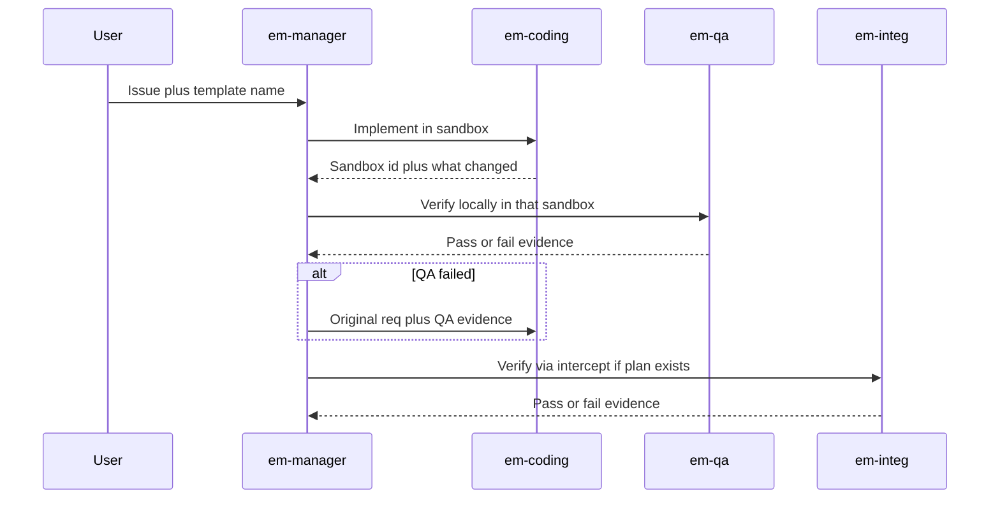
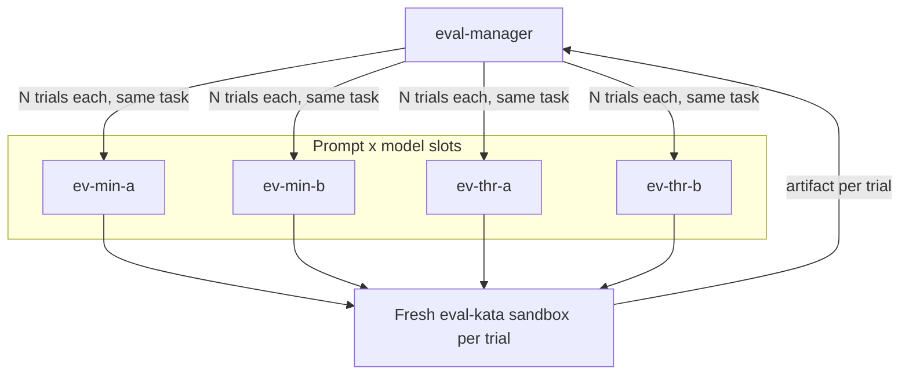

# Agent patterns

Reusable Crafting Agent UI patterns. Each pattern is a set of custom agents (and, for eval, a sandbox template) you install on your own org.

These examples are not tied to a particular product, template, or site. After install, you point the engineering manager at *your* templates and issues, and the eval matrix at *your* org’s LLM catalog.

To install, start a **new session** in Crafting Agent UI with the default agent (do not pick a custom agent). Paste that pattern’s install prompt as the entire message. The default agent checks out this repository, follows [INSTALL.md](INSTALL.md), and prints what to run next. You need permission to create org-shared agents (`cs llm agent create --shared`); if you are not an org admin, install still works as personal agents.

## Engineering manager

A coordinator (`em-manager`) that does **not** write code. It plans, delegates, and checks work. Specialists (`em-coding`, `em-qa`, `em-integ`) each get a self-contained task in their own session, so the manager’s context stays small.

Use this when a change needs implementation plus verification, and you want the coordinator to loop on evidence instead of accumulating a huge coding transcript.



```
Set up the engineering manager pattern from https://github.com/crafting-demo/agent-patterns. Create a sandbox from that repo if needed (or git pull if it already exists), open a workspace, follow INSTALL.md without asking for confirmation, and finish by printing the example prompt.
```

After install, start a **new** session, select agent `em-manager`, and paste [patterns/engineering-manager/example-prompt.md](patterns/engineering-manager/example-prompt.md) — or your own issue plus a template name from your org. The manager lists templates if you do not name one.

More detail: [patterns/engineering-manager/README.md](patterns/engineering-manager/README.md)

## Agent eval

Compare **prompt × model** variants of the same coding agent on a fixed kata. The orchestrator (`eval-manager`) does not implement the task. Each candidate is a sub-agent with its own `model:` (`provider:name`) and prompt. Each trial is a new session with a fresh sandbox from template `eval-kata`.

Use this when you want to try models **before** assigning org purposes like CODING or FAST. Point slot A and slot B at any two models already in your org catalog.



```
Set up the agent eval pattern from https://github.com/crafting-demo/agent-patterns. Create a sandbox from that repo if needed (or git pull if it already exists), open a workspace, follow INSTALL.md without asking for confirmation, and finish by printing the example prompt.
```

After install, start a **new** session, select agent `eval-manager`, and paste [patterns/agent-eval/example-prompt.md](patterns/agent-eval/example-prompt.md). Do **not** set a session model override, or every cell can collapse to one model.

A ranking is valid only if **both** slots produced implementation artifacts. Provider 5xx / RPC errors are incomplete trials: `eval-manager` retries, then rebinds the dead slot to another catalog model and re-runs those cells.

More detail: [patterns/agent-eval/README.md](patterns/agent-eval/README.md)
