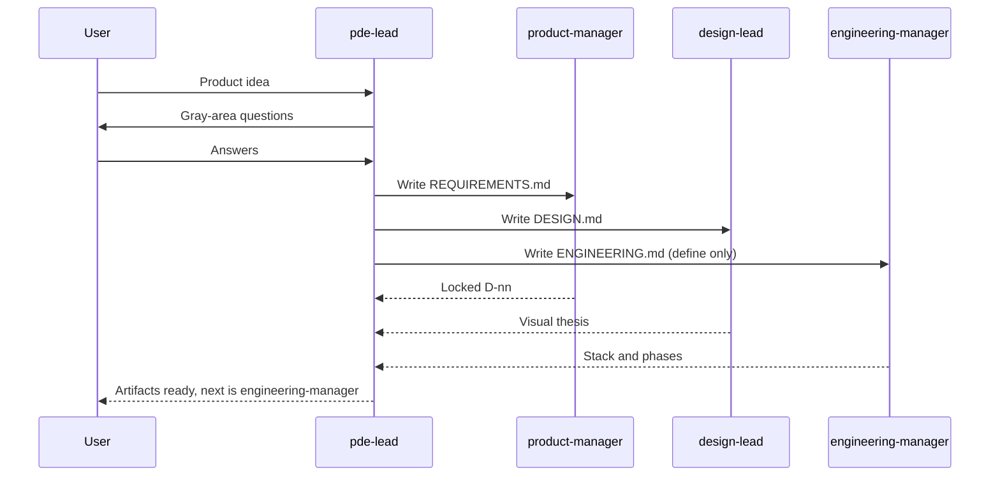
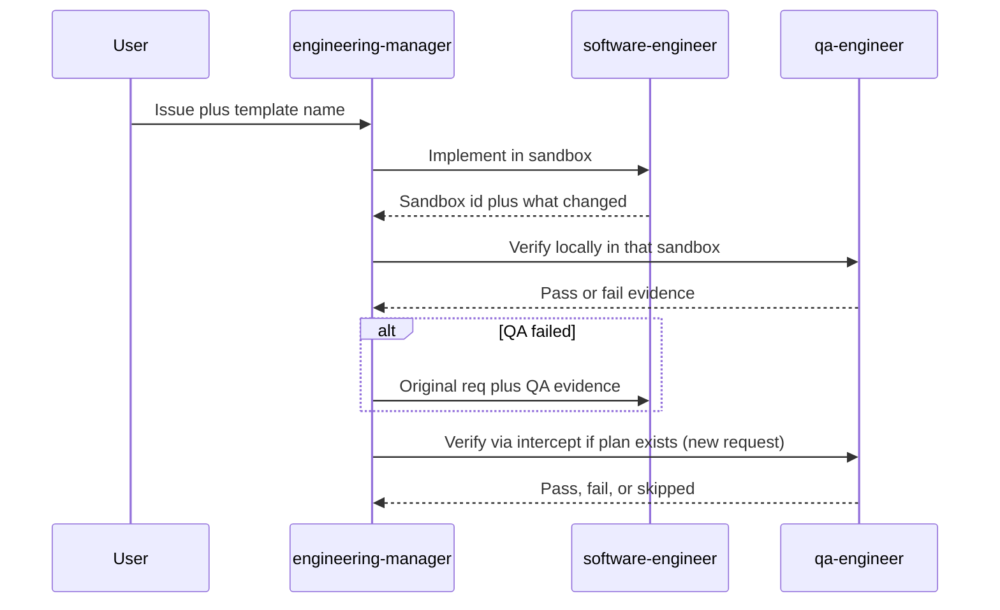
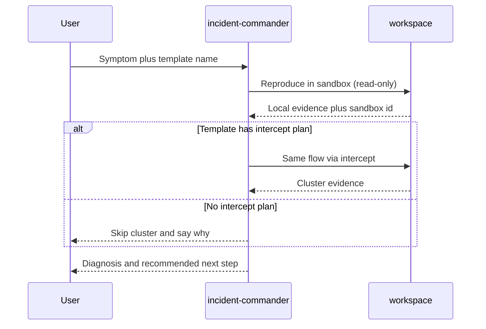
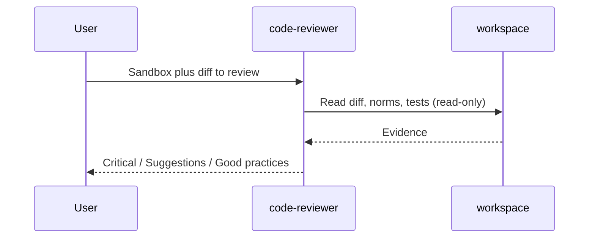
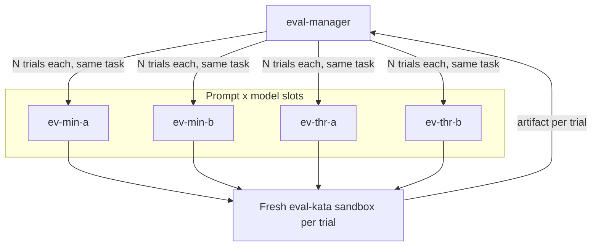
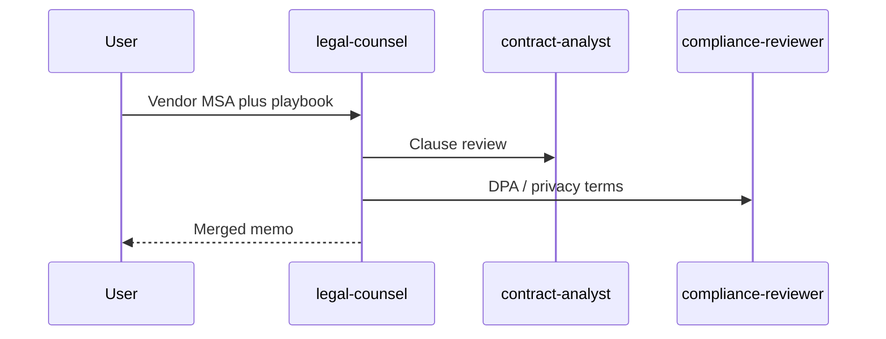

# Agent patterns

Reusable Crafting Agent UI patterns. Each pattern is a set of custom agents (and, for eval, a sandbox template) you install on your own org.

These examples are not tied to a particular product, template, or site. After install, you point the PDE team, engineering manager, incident commander, and code review team at *your* templates and sandboxes, and the eval matrix at *your* org’s LLM catalog.

Roles and isolation follow published designs from Anthropic, Google, GitHub, OpenAI, and OWASP. See [SOURCES.md](SOURCES.md).

The agent definitions come from the [Crafting Agent Hub](https://github.com/crafting-demo/agent-hub) catalog, which is the source of truth. Every pattern except agent eval installs hub agents: their compiled YAML is committed here, pinned to a hub commit, so install works from this checkout alone. See [HUB.md](HUB.md). A pattern is a team plus an example task; the agents themselves are defined once, in the hub.

## Patterns

| Pattern | Start agent | Use when | Output |
| --- | --- | --- | --- |
| [PDE team](#pde-team) | `pde-lead` | You have an idea, not a spec | `REQUIREMENTS.md`, `DESIGN.md`, `ENGINEERING.md` in a sandbox |
| [Engineering manager](#engineering-manager) | `engineering-manager` | A change needs implementation plus local and cluster verification | Verified change in a sandbox (no PR unless asked) |
| [Incident commander](#incident-commander) | `incident-commander` | Something broke and you want to know where | Diagnosis and next step, no patch |
| [Code review](#code-review) | `code-reviewer` | A change exists and you want a gate | One Critical / Suggestions / Good practices review |
| [Agent eval](#agent-eval) | `eval-manager` | You want to compare prompts and models before assigning purposes | Ranked prompt × model matrix |
| [Vendor contract review](#vendor-contract-review) | `legal-counsel` | You have a vendor agreement to triage | Merged GREEN/YELLOW/RED memo (draft for attorney review) |
| [Secure delivery](#secure-delivery) | `engineering-manager` | A change needs implementation, QA, and a URL scan | Verified change; scan report |
| [Backlog to reviewed change](#backlog-to-reviewed-change) | `product-manager` then `engineering-manager` then `code-reviewer` | Idea or ticket through delivery and a review gate | Spec, verified change, merged review |

Typical order: PDE team → engineering manager → code review. Incident commander and agent eval stand alone. Engineering manager and secure delivery install the same four agents; they differ in the example task (cluster pass vs URL scan).

## Install

To install, start a **new session** in Crafting Agent UI with the default agent (do not pick a custom agent). Paste that pattern’s install prompt as the entire message. The default agent checks out this repository, follows [INSTALL.md](INSTALL.md), and prints what to run next. You need permission to create org-shared agents (`cs llm agent create --shared`); if you are not an org admin, install still works as personal agents.

## PDE team

A coordinator (`pde-lead`) that does **not** implement. It asks the user the hard product questions, locks the answers as numbered decisions, then fans out to `product-manager`, `design-lead`, and `engineering-manager`. Those write `REQUIREMENTS.md`, `DESIGN.md`, and `ENGINEERING.md` in a sandbox. Implementation is a later `engineering-manager` session on the same sandbox.

Use this when the work is still “what are we building and how should it look,” not “implement this issue.” Product definition follows GSD discuss / new-project (locked D-nn decisions). Design follows Anthropic `frontend-design` and OpenAI `frontend-skill` (visual thesis first, no AI-slop defaults).



```
Set up the PDE team pattern from https://github.com/crafting-demo/agent-patterns. Create a sandbox from that repo if needed (or git pull if it already exists), open a workspace, follow INSTALL.md without asking for confirmation, and finish by printing the example prompt.
```

After install, start a **new** session, select agent `pde-lead`, and paste [patterns/pde-team/example-prompt.md](patterns/pde-team/example-prompt.md) — or your own product idea plus a template name from your org.

More detail: [patterns/pde-team/README.md](patterns/pde-team/README.md)

## Engineering manager

A coordinator (`engineering-manager`) that does **not** write code. It plans, delegates, and checks work. Specialists (`software-engineer`, `qa-engineer`) each get a self-contained task in their own session, so the manager’s context stays small.

Use this when a change needs implementation plus verification, and you want the coordinator to loop on evidence instead of accumulating a huge coding transcript. This pattern's task verifies twice: a local pass, then a cluster pass through the template's Kubernetes intercept plan. Both are `qa-engineer`, as two separate requests, so a fresh session grades the cluster result.



```
Set up the engineering manager pattern from https://github.com/crafting-demo/agent-patterns. Create a sandbox from that repo if needed (or git pull if it already exists), open a workspace, follow INSTALL.md without asking for confirmation, and finish by printing the example prompt.
```

After install, start a **new** session, select agent `engineering-manager`, and paste [patterns/engineering-manager/example-prompt.md](patterns/engineering-manager/example-prompt.md) — or your own issue plus a template name from your org. The manager lists templates if you do not name one.

More detail: [patterns/engineering-manager/README.md](patterns/engineering-manager/README.md)

## Incident commander

A single diagnostician (`incident-commander`) that does **not** patch. It reproduces the symptom in a sandbox, optionally repeats the flow through the template's intercept plan to compare against the cluster, and writes a diagnosis with a recommended next step, not a pull request.

Use this when the question is “what broke and where,” not “implement this issue.”



```
Set up the incident commander pattern from https://github.com/crafting-demo/agent-patterns. Create a sandbox from that repo if needed (or git pull if it already exists), open a workspace, follow INSTALL.md without asking for confirmation, and finish by printing the example prompt.
```

After install, start a **new** session, select agent `incident-commander`, and paste [patterns/incident-commander/example-prompt.md](patterns/incident-commander/example-prompt.md) — or your own symptom plus a template name from your org. The agent lists templates if you do not name one.

More detail: [patterns/incident-commander/README.md](patterns/incident-commander/README.md)

## Code review

A single reviewer (`code-reviewer`) that does **not** patch. It reads the diff and covers quality, correctness, and defensive security in one pass, mapped to OWASP Top 10 and CWE. It is instruction-enforced read-only (Crafting has no tool allowlist). The output is one review, not a PR.

Use this when a change already exists and you want a gate. Ask for a security-only review when you want that lens alone.



```
Set up the code review pattern from https://github.com/crafting-demo/agent-patterns. Create a sandbox from that repo if needed (or git pull if it already exists), open a workspace, follow INSTALL.md without asking for confirmation, and finish by printing the example prompt.
```

After install, start a **new** session, select agent `code-reviewer`, and paste [patterns/code-review/example-prompt.md](patterns/code-review/example-prompt.md) — or name a sandbox that already has the change.

More detail: [patterns/code-review/README.md](patterns/code-review/README.md)

## Agent eval

Compare **prompt × model** variants of the same coding agent on a fixed kata. The orchestrator (`eval-manager`) does not implement the task. Each candidate is a sub-agent with its own `model:` (`provider:name`) and prompt. Each trial is a new session with a fresh sandbox from template `eval-kata`.

Use this when you want to try models **before** assigning org purposes like CODING or FAST. Point slot A and slot B at any two models already in your org catalog.



```
Set up the agent eval pattern from https://github.com/crafting-demo/agent-patterns. Create a sandbox from that repo if needed (or git pull if it already exists), open a workspace, follow INSTALL.md without asking for confirmation, and finish by printing the example prompt.
```

After install, start a **new** session, select agent `eval-manager`, and paste [patterns/agent-eval/example-prompt.md](patterns/agent-eval/example-prompt.md). Do **not** set a session model override, or every cell can collapse to one model.

A ranking is valid only if **both** slots produced implementation artifacts. Provider 5xx / RPC errors are incomplete trials: `eval-manager` retries, then rebinds the dead slot to another catalog model and re-runs those cells.

More detail: [patterns/agent-eval/README.md](patterns/agent-eval/README.md)

## Vendor contract review

A coordinator (`legal-counsel`) that does **not** give legal advice. It fans the same vendor agreement to `contract-analyst` and `compliance-reviewer`. Output is one GREEN / YELLOW / RED memo, labeled as a draft for attorney review. The personas come from the hub catalog (Anthropic knowledge-work legal plugin, paraphrased).

Use this when the work is “what is wrong with this vendor paper,” not “implement this issue.” It is also the pattern to show someone who assumes agents only write code — a short demo contract (as a `.docx`, since that is how contracts actually arrive) and a negotiation playbook ship in `fixtures/`. The specialists' sandbox template installs pandoc to read Word files and to hand redlines back as `.docx`.



```
Set up the vendor contract review pattern from https://github.com/crafting-demo/agent-patterns. Create a sandbox from that repo if needed (or git pull if it already exists), open a workspace, follow INSTALL.md without asking for confirmation, and finish by printing the example prompt.
```

After install, start a **new** session, select `legal-counsel`, and paste [patterns/vendor-contract-review/example-prompt.md](patterns/vendor-contract-review/example-prompt.md).

More detail: [patterns/vendor-contract-review/README.md](patterns/vendor-contract-review/README.md)

## Secure delivery

`engineering-manager` implements via `software-engineer`, verifies with `qa-engineer`, then scans reported URLs with `security-scanner` (lonkero CLI planted by the agent's sandbox template, like the demo-org webscan agent). Hub agents; no exploits.

```
Set up the secure delivery pattern from https://github.com/crafting-demo/agent-patterns. Create a sandbox from that repo if needed (or git pull if it already exists), open a workspace, follow INSTALL.md without asking for confirmation, and finish by printing the example prompt.
```

After install, start a **new** session, select `engineering-manager`, and paste [patterns/secure-delivery/example-prompt.md](patterns/secure-delivery/example-prompt.md).

More detail: [patterns/secure-delivery/README.md](patterns/secure-delivery/README.md)

## Backlog to reviewed change

Three sessions: `product-manager` writes a spec, `engineering-manager` delivers it, `code-reviewer` gates the diff. Hub agents. The product manager ships with no ticket board bound and works from a pasted backlog; binding Jira or Linear means re-vendoring that agent from the hub ([HUB.md](HUB.md)).

```
Set up the backlog to reviewed change pattern from https://github.com/crafting-demo/agent-patterns. Create a sandbox from that repo if needed (or git pull if it already exists), open a workspace, follow INSTALL.md without asking for confirmation, and finish by printing the example prompt.
```

After install, run the three sessions in [patterns/backlog-to-change/example-prompt.md](patterns/backlog-to-change/example-prompt.md).

More detail: [patterns/backlog-to-change/README.md](patterns/backlog-to-change/README.md)
