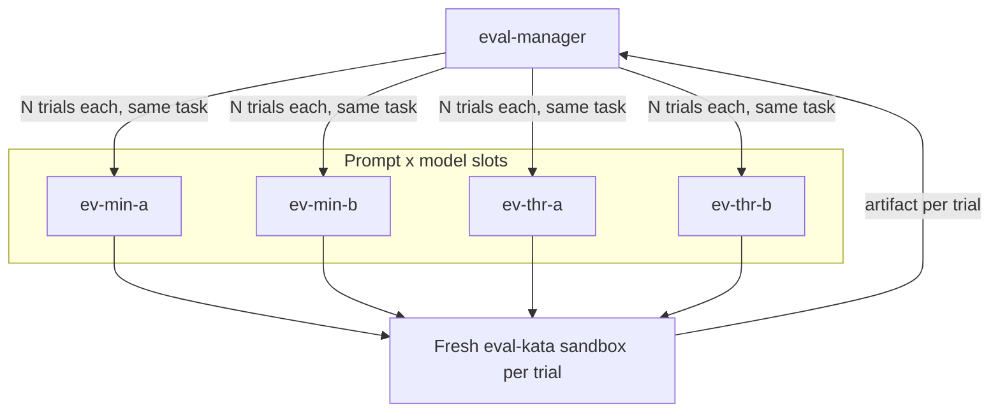

# Agent eval

Compare **prompt × model** variants of the same coding agent on a fixed kata. The orchestrator (`eval-manager`) does not implement the task. Each candidate is a sub-agent with its own `model:` (`provider:name`) and prompt. Each trial is a new session, which creates a fresh sandbox from template `eval-kata`.

Use this when you want to try models **before** assigning org purposes like CODING or FAST. Point slot A and slot B at any two models already in your org catalog (`openai:gpt-5.4`, an OpenRouter id, and so on).



## Matrix

See [matrix.md](matrix.md). Default sample run is **N=1 trial per cell** (four sandboxes). The manager default is N=3 if you do not say otherwise.

## What gets created

- Template `eval-kata` (workspace `dev`, kata files under `~/kata`)
- `eval-manager`
- `ev-min-a`, `ev-min-b`, `ev-thr-a`, `ev-thr-b` (sub-agents only)

## How to run

1. Install with the root README one-liner (default agent). The installer binds slots A and B from `cs llm model list` unless you named two `provider:name` selectors in the install message.
2. Start a **new** session, select agent `eval-manager`, paste [example-prompt.md](example-prompt.md).
3. Do **not** set a session model override. That would collapse every cell to one model.
4. A ranking is valid only if **both** slots produced implementation artifacts. Provider 5xx / RPC errors are incomplete trials: `eval-manager` retries, then rebinds the dead slot to another catalog model and re-runs those cells. If it still cannot exercise two models, it must say the eval did not complete rather than rank a half-empty matrix.

See [SOURCES.md](../../SOURCES.md) for the published agent designs this pattern follows.

## Remove

```sh
cs llm agent remove eval-manager --shared
cs llm agent remove ev-min-a --shared
cs llm agent remove ev-min-b --shared
cs llm agent remove ev-thr-a --shared
cs llm agent remove ev-thr-b --shared
cs template remove eval-kata
```
