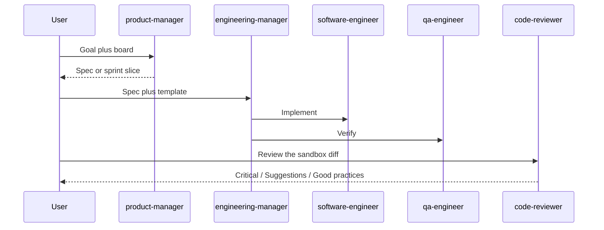

# Backlog to reviewed change

Multi-agent demo across **sessions**: `product-manager` specs the work from a pasted backlog (no ticket board bound here; see [HUB.md](../../HUB.md) to attach Jira or Linear), `engineering-manager` delivers with `software-engineer` + `qa-engineer`, then `code-reviewer` gates the diff.

The agents come from the [Crafting Agent Hub](https://github.com/crafting-demo/agent-hub); their compiled definitions live in `agents/` and `templates/` here, pinned to a hub commit ([HUB.md](../../HUB.md)).



## Install

```
Set up the backlog to reviewed change pattern from https://github.com/crafting-demo/agent-patterns. Create a sandbox from that repo if needed (or git pull if it already exists), open a workspace, follow INSTALL.md without asking for confirmation, and finish by printing the example prompt.
```

After install, run **three** new sessions in order: `product-manager` → `engineering-manager` → `code-reviewer`. Prompts: [example-prompt.md](example-prompt.md).
