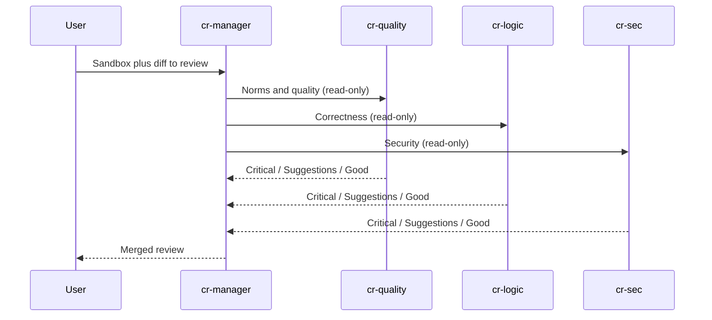

# Code review

A coordinator (`cr-manager`) that does **not** patch. It fans the same diff out to `cr-quality`, `cr-logic`, and `cr-sec`. Each specialist runs in its own session. The output is one review (Critical / Suggestions / Good practices), not a pull request.

Crafting `LLMAgent` has no read-only tool allowlist (unlike Anthropic’s `Read`/`Grep`/`Glob`). Specialists still join a workspace so they can read the diff; instructions forbid writes. See [SOURCES.md](../../SOURCES.md).

Use this when a change already exists (human, `em-coding`, or a PR sandbox) and you want a gate, not another implementer.



## What gets created

| Agent | Role |
| --- | --- |
| `cr-manager` | Fan-out, merge, publish. No sandbox writes. |
| `cr-quality` | Team norms, structure, tests, comments. |
| `cr-logic` | Correctness, edge cases, silent failures. |
| `cr-sec` | OWASP-oriented defensive review. No exploits. |

## How to run

1. Install with the root README prompt for this pattern (default agent).
2. Start a **new** session and select agent `cr-manager`.
3. Paste [example-prompt.md](example-prompt.md), or name a sandbox that already has the change.

## Remove

```sh
cs llm agent remove cr-manager --shared
cs llm agent remove cr-quality --shared
cs llm agent remove cr-logic --shared
cs llm agent remove cr-sec --shared
```
