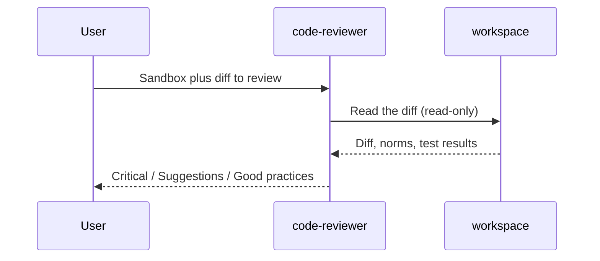

# Code review

A single reviewer (`code-reviewer`) that does **not** patch. It reads the diff in an existing sandbox and covers three lenses in one pass: quality, correctness, and defensive security (mapped to OWASP Top 10 and CWE). The output is one review (Critical / Suggestions / Good practices), not a pull request.

The agent comes from the [Crafting Agent Hub](https://github.com/crafting-demo/agent-hub); its compiled definition lives in `agents/` and `templates/` here, pinned to a hub commit ([HUB.md](../../HUB.md)). The three lenses follow the specialist split in Anthropic's pr-review-toolkit; the hub collapses them into one agent because they take the same input and produce the same report.

Crafting `LLMAgent` has no read-only tool allowlist (unlike Anthropic's `Read`/`Grep`/`Glob`). The agent still joins a workspace so it can read the diff; instructions forbid writes, and it restates that contract on every workspace transfer.

Use this when a change already exists (human, `software-engineer`, or a PR sandbox) and you want a gate, not another implementer. Ask for a security-only review when you want that lens alone.



## What gets created

| Agent | Role |
| --- | --- |
| `code-reviewer` | Quality, correctness, and security in one read-only review. No exploits, no patches. |

If the repo under review has a `NORMS.md`, `CONTRIBUTING.md`, `AGENTS.md`, `CLAUDE.md`, or Copilot instructions file, the reviewer treats it as the team checklist. A sample [NORMS.md](NORMS.md) is in this directory.

## How to run

1. Install with the root README prompt for this pattern (default agent).
2. Start a **new** session and select agent `code-reviewer`.
3. Paste [example-prompt.md](example-prompt.md), or name a sandbox that already has the change.

## Remove

```sh
cs llm agent remove code-reviewer --shared
cs template remove hub-code-reviewer
```

`code-reviewer` is shared with `backlog-to-change`; remove it only if that pattern is not installed.
