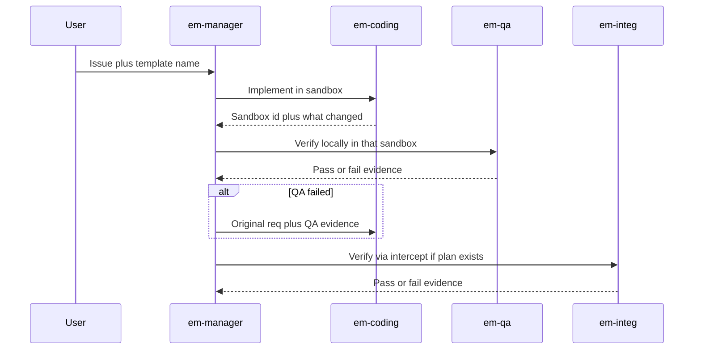

# Engineering manager

A coordinator agent (`em-manager`) that does **not** write code. It plans, delegates, and checks work. Specialists (`em-coding`, `em-qa`, `em-integ`) each get a self-contained task in their own session. The manager’s context stays small; specialists get a scoped goal and, when the manager iterates, a fresh session.

This is useful when a change needs implementation plus verification, and you want the coordinator to loop on evidence instead of accumulating a huge coding transcript.



## What gets created

| Agent | Role |
| --- | --- |
| `em-manager` | Plan, delegate, check, loop. No sandbox operation. |
| `em-coding` | Implement in a sandbox (sub-agent only). |
| `em-qa` | Local verification. Reports only; does not patch. |
| `em-integ` | Cluster verification via `cs k8s intercept` when the template has a plan. Reports only. Skip if there is no intercept plan. |

## How to run

1. Install with the root README one-liner (default agent).
2. Start a **new** session and select agent `em-manager`.
3. Paste [example-prompt.md](example-prompt.md), or your own issue plus a template name from your org.

The manager lists templates if you do not name one. It does not assume a particular app.

## Remove

```sh
cs llm agent remove em-manager --shared
cs llm agent remove em-coding --shared
cs llm agent remove em-qa --shared
cs llm agent remove em-integ --shared
```
