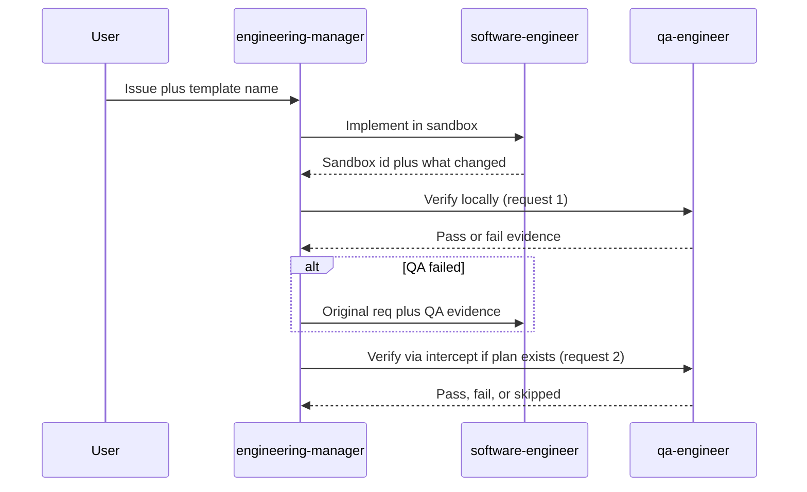

# Engineering manager

A coordinator (`engineering-manager`) that does **not** write code. It plans, delegates, and checks work. Specialists (`software-engineer`, `qa-engineer`) each get a self-contained task in their own session, so the manager's context stays small and the manager iterates on evidence instead of accumulating a coding transcript.

The agents come from the [Crafting Agent Hub](https://github.com/crafting-demo/agent-hub); their compiled definitions live in `agents/` and `templates/` here, pinned to a hub commit ([HUB.md](../../HUB.md)).

This pattern's example runs verification twice: a local pass, then a cluster pass through the template's Kubernetes intercept plan. Both are `qa-engineer`, sent as two separate requests, so the cluster result is graded by a fresh session that did not just pass locally. With no intercept plan the second pass reports skipped.



## What gets created

| Agent | Role |
| --- | --- |
| `engineering-manager` | Plan, delegate, check, loop. No sandbox operation. |
| `software-engineer` | Implement in a sandbox. |
| `qa-engineer` | Local pass, then cluster pass via `cs k8s intercept` when the template has a plan. Reports only; does not patch. |
| `security-scanner` | Not used by this pattern's task. Created because `engineering-manager` names it; see `secure-delivery`. |

## How to run

1. Install with the root README prompt (default agent).
2. Start a **new** session and select agent `engineering-manager`.
3. Paste [example-prompt.md](example-prompt.md), or your own issue plus a template name from your org.

The manager lists templates if you do not name one. It does not assume a particular app.

## Remove

```sh
cs llm agent remove engineering-manager --shared
cs llm agent remove security-scanner --shared
cs llm agent remove qa-engineer --shared
cs llm agent remove software-engineer --shared
```

These four agents are shared with `pde-team`, `secure-delivery`, and `backlog-to-change`; remove them only if none of those are installed.
