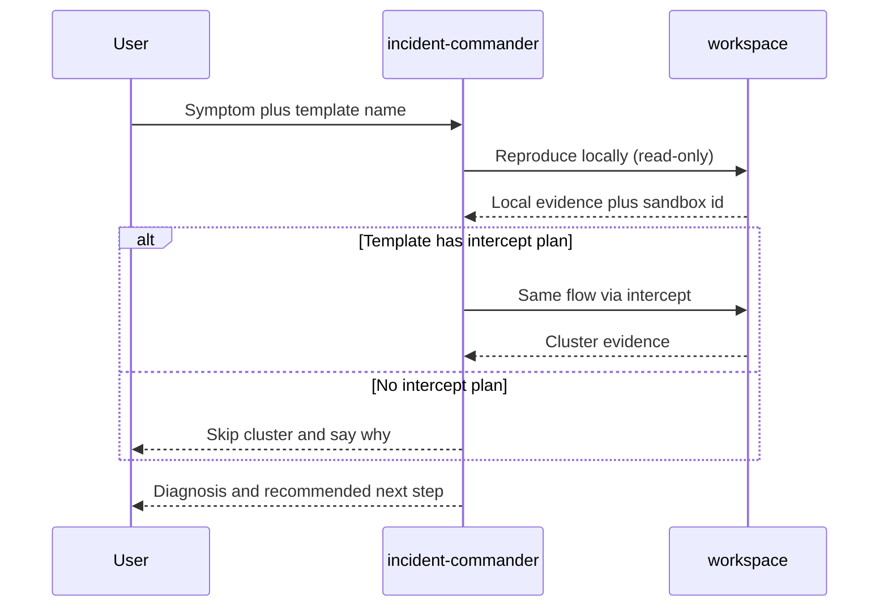

# Incident commander

A single diagnostician (`incident-commander`) that does **not** patch. It reproduces a symptom in a sandbox, optionally repeats the same flow through the template's Kubernetes intercept plan to compare against the cluster, and writes a diagnosis with a recommended next step. The output is evidence, not a pull request.

The agent comes from the [Crafting Agent Hub](https://github.com/crafting-demo/agent-hub); its compiled definition lives in `agents/` and `templates/` here, pinned to a hub commit ([HUB.md](../../HUB.md)).

Use this when the question is "what broke and where," not "implement this issue." If a product fix is indicated, hand the sandbox and the diagnosis to `engineering-manager`.



## What gets created

| Agent | Role |
| --- | --- |
| `incident-commander` | Reproduce locally, compare via `cs k8s intercept` when the template has a plan, diagnose. Does not patch. |

## How to run

1. Install with the root README prompt for this pattern (default agent).
2. Start a **new** session and select agent `incident-commander`.
3. Paste [example-prompt.md](example-prompt.md), or your own symptom plus a template name from your org.

The agent lists templates if you do not name one. It does not assume a particular app. If the example path (`POST /api/cart/total`) does not exist in that app, it reports that as evidence and checks the closest endpoint it can find.

## Remove

```sh
cs llm agent remove incident-commander --shared
cs template remove hub-incident-commander
```
