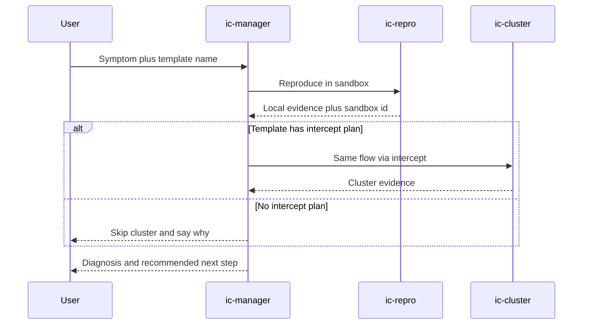

# Incident commander

A coordinator (`ic-manager`) that does **not** patch. It plans, delegates reproduction, and optional cluster checks. Specialists (`ic-repro`, `ic-cluster`) each get a self-contained task in their own session. The output is a diagnosis and a recommended next step, not a pull request.

Use this when the question is “what broke and where,” not “implement this issue.” If a product fix is indicated, hand the sandbox and the diagnosis to a delivery coordinator such as `em-manager`.



## What gets created

| Agent | Role |
| --- | --- |
| `ic-manager` | Plan, delegate, diagnose. No sandbox operation. Does not patch. |
| `ic-repro` | Reproduce locally in a sandbox (sub-agent only). |
| `ic-cluster` | Same symptom via `cs k8s intercept` when the template has a plan. Skip if there is none. |

## How to run

1. Install with the root README prompt for this pattern (default agent).
2. Start a **new** session and select agent `ic-manager`.
3. Paste [example-prompt.md](example-prompt.md), or your own symptom plus a template name from your org.

The manager lists templates if you do not name one. It does not assume a particular app. If the example path (`POST /api/cart/total`) does not exist in that app, specialists report that as evidence and check the closest endpoint they can find.

## Remove

```sh
cs llm agent remove ic-manager --shared
cs llm agent remove ic-repro --shared
cs llm agent remove ic-cluster --shared
```
