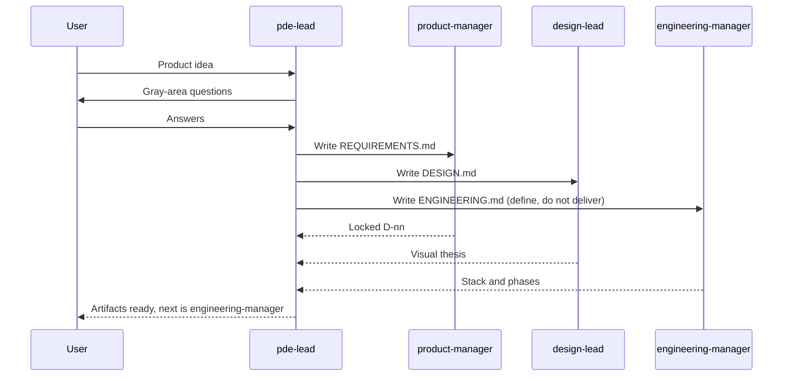

# PDE team

Product, design, and engineering lock the product **before** anyone implements. The lead (`pde-lead`) asks the user the hard questions and locks the answers as numbered decisions. Specialists write `REQUIREMENTS.md`, `DESIGN.md`, and `ENGINEERING.md` in a sandbox. Implementation is a later `engineering-manager` session on the same sandbox.

The agents come from the [Crafting Agent Hub](https://github.com/crafting-demo/agent-hub); their compiled definitions live in `agents/` and `templates/` here, pinned to a hub commit ([HUB.md](../../HUB.md)). Process follows the GSD discuss / new-project loop (locked decisions, no coding yet) and the Anthropic and OpenAI frontend skills (commit to a look before CSS).



## What gets created

| Agent | Role here |
| --- | --- |
| `pde-lead` | Asks the user, locks decisions, fans out. Does not implement. |
| `product-manager` | `REQUIREMENTS.md` with locked `D-nn` decisions and deferred ideas. |
| `design-lead` | Visual thesis and `DESIGN.md`. No app code. |
| `engineering-manager` | `ENGINEERING.md`: stack, boundaries, phases. In this pattern it defines; it does not deliver. |
| `software-engineer`, `qa-engineer`, `security-scanner` | Not used during definition. Created because `engineering-manager` names them as sub-agents, and they are what a later delivery session runs. |

Two of the specialists do double duty in the hub. `product-manager` also runs a live ticket board, and `engineering-manager` also delivers changes. `pde-lead` tells each to define, not operate or deliver.

## How to run

1. Install with the root README prompt (default agent).
2. Start a **new** session, select `pde-lead`, paste [example-prompt.md](example-prompt.md).
3. Answer the questions in the session.
4. When the three markdown files exist, start a new `engineering-manager` session on that sandbox to build the first phase.

## Remove

```sh
cs llm agent remove pde-lead --shared
cs llm agent remove engineering-manager --shared
cs llm agent remove design-lead --shared
cs llm agent remove product-manager --shared
cs llm agent remove security-scanner --shared
cs llm agent remove qa-engineer --shared
cs llm agent remove software-engineer --shared
```

The `software-engineer`, `qa-engineer`, `security-scanner`, and `engineering-manager` agents are shared with the other engineering patterns; remove them only if none of those are installed.
