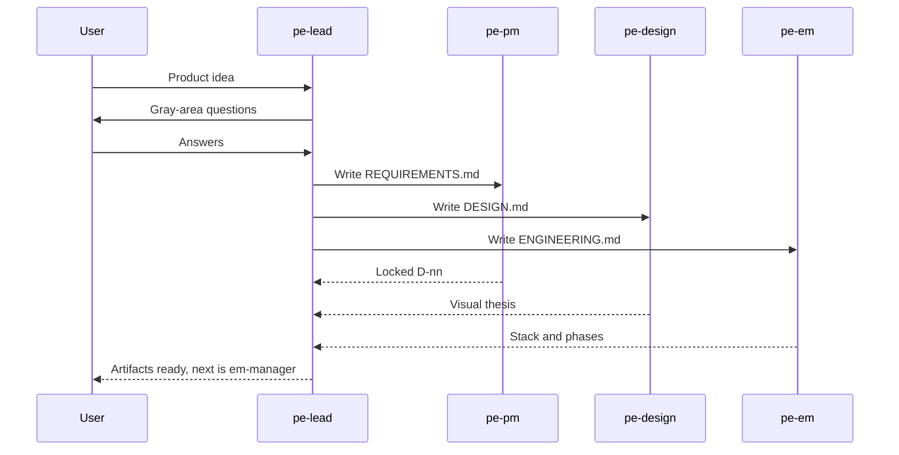

# PDE team

Product, design, and engineering lock the product **before** anyone implements. The lead (`pe-lead`) asks the user the hard questions. Specialists write `REQUIREMENTS.md`, `DESIGN.md`, and `ENGINEERING.md` in a sandbox. Implementation is a later `em-manager` session.

This is the GSD discuss / new-project loop (locked decisions, no coding yet) plus Anthropic and OpenAI frontend skills (commit to a look before CSS). Optional Slack pings go through [coworker-bot](https://github.com/crafting-demo/coworker-bot). See [SOURCES.md](../../SOURCES.md).



## What gets created

| Agent | Role |
| --- | --- |
| `pe-lead` | Asks the user, fans out, does not implement. |
| `pe-pm` | Requirements and locked product decisions. |
| `pe-design` | Visual thesis and DESIGN.md. No app code. |
| `pe-em` | Engineering decisions and phases. No app code. |
| `pe-notify` | Slack ping if coworker-bot/Slack exists; otherwise skip. |

## How to run

1. Install with the root README prompt (default agent).
2. Start a **new** session, select `pe-lead`, paste [example-prompt.md](example-prompt.md).
3. Answer questions in the session (or Slack if notify is live).
4. When the three markdown files exist, start `em-manager` on that sandbox to build.

## Remove

```sh
cs llm agent remove pe-lead --shared
cs llm agent remove pe-pm --shared
cs llm agent remove pe-design --shared
cs llm agent remove pe-em --shared
cs llm agent remove pe-notify --shared
```
