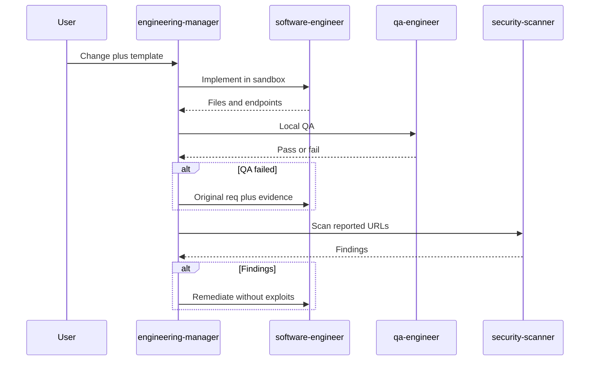

# Secure delivery

Multi-agent demo: `engineering-manager` delegates to `software-engineer`, then `qa-engineer`, then `security-scanner` (lonkero CLI in an exec template). Findings go back to the implementer until clean or blocked.

Agents compile from [crafting-demo/agent-hub](https://github.com/crafting-demo/agent-hub). The scanner is the hub `security-scanner` package (demo-org webscan pattern).



## Install

```
Set up the secure delivery pattern from https://github.com/crafting-demo/agent-patterns. Create a sandbox from that repo if needed (or git pull if it already exists), open a workspace, follow INSTALL.md without asking for confirmation, and finish by printing the example prompt.
```

After install, start a **new** session, select `engineering-manager`, and paste [example-prompt.md](example-prompt.md).
