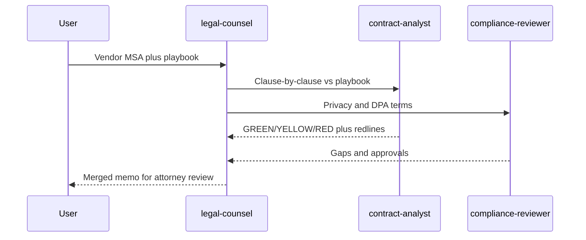

# Vendor contract review

Non-technical multi-agent demo. `legal-counsel` fans the same vendor agreement out to `contract-analyst` (playbook + redlines) and `compliance-reviewer` (DPA / GDPR / CCPA terms), then merges a memo.

Agents are compiled from [crafting-demo/agent-hub](https://github.com/crafting-demo/agent-hub). Every output is a **draft for attorney review**, not legal advice.



## Install

```
Set up the vendor contract review pattern from https://github.com/crafting-demo/agent-patterns. Create a sandbox from that repo if needed (or git pull if it already exists), open a workspace, follow INSTALL.md without asking for confirmation, and finish by printing the example prompt.
```

After install, start a **new** session, select `legal-counsel`, and paste [example-prompt.md](example-prompt.md).

The sample MSA in `fixtures/` is an original short demo contract (not a CUAD dump). Swap in a public CUAD agreement if you want a longer corpus.
