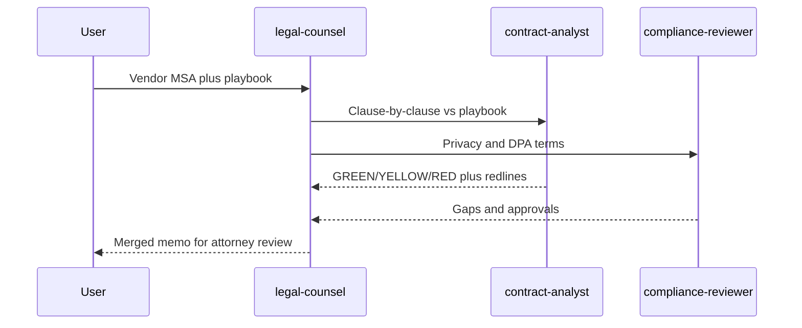

# Vendor contract review

Non-technical multi-agent demo. `legal-counsel` fans the same vendor agreement out to `contract-analyst` (playbook + redlines) and `compliance-reviewer` (DPA / GDPR / CCPA terms), then merges a memo.

The agents come from the [Crafting Agent Hub](https://github.com/crafting-demo/agent-hub); their compiled definitions live in `agents/` and `templates/` here, pinned to a hub commit ([HUB.md](../../HUB.md)). Every output is a **draft for attorney review**, not legal advice.



## Install

```
Set up the vendor contract review pattern from https://github.com/crafting-demo/agent-patterns. Create a sandbox from that repo if needed (or git pull if it already exists), open a workspace, follow INSTALL.md without asking for confirmation, and finish by printing the example prompt.
```

After install, start a **new** session, select `legal-counsel`, and paste [example-prompt.md](example-prompt.md).

## Fixtures

Contracts arrive as Word files, so the demo does too. `fixtures/sample-msa.docx` is what the prompt hands to the agents; `contract-analyst` and `compliance-reviewer` convert it with pandoc, which their sandbox template installs. `fixtures/sample-msa.md` is the readable source that `.docx` was generated from (`pandoc sample-msa.md -f gfm -o sample-msa.docx`); edit the Markdown and regenerate rather than editing the Word file. `fixtures/PLAYBOOK.md` holds illustrative negotiation positions — replace it with your own before trusting the flags.

The MSA is an original short demo contract (not a CUAD dump). Swap in any real `.docx` agreement to try it on something longer. Legacy `.doc` and PDF are not converted; the agents will ask for a `.docx` export.
